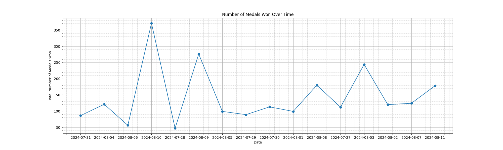
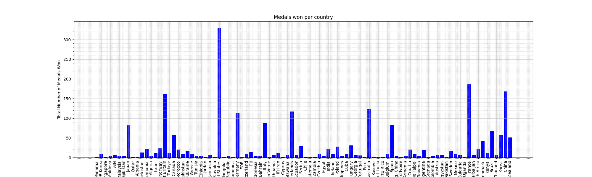

# Mini Project: Pandas Descriptive Statistics

Adil Keku Gazder   ag825, adil.gazder@duke.edu  IDS 706: Data Engineering Systems  Duke University, Fall 2024

The aim with this project was to read a .csv file and generate summary statistics and plots describing the data. The dataset used for this project was acquired from Kaggle (Olympic Summer Games - Paris 2024 -> medallists.csv)  

Link to the dataset: (https://www.kaggle.com/datasets/muhammadehsan02/olympic-summer-games-paris-2024?select=medallists.csv)

## Distribution of total medals achieved totally over each day of the olympics

## Distribution of total medals achieved per each country
